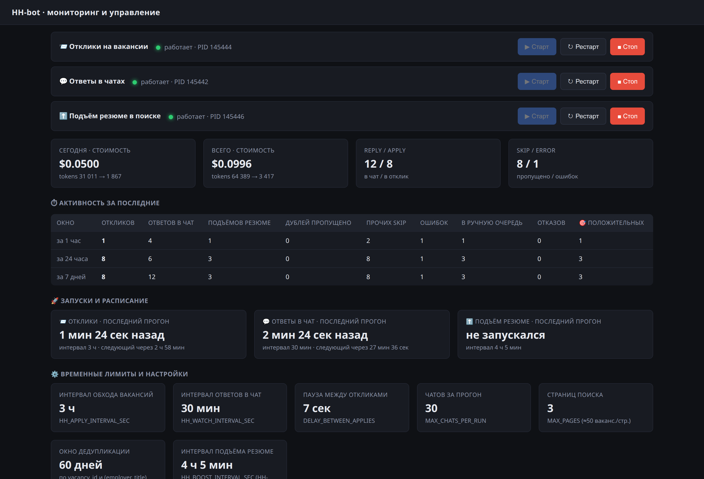
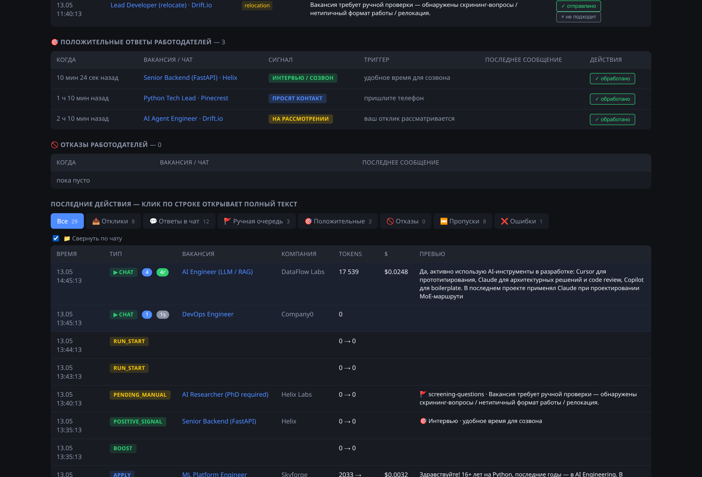
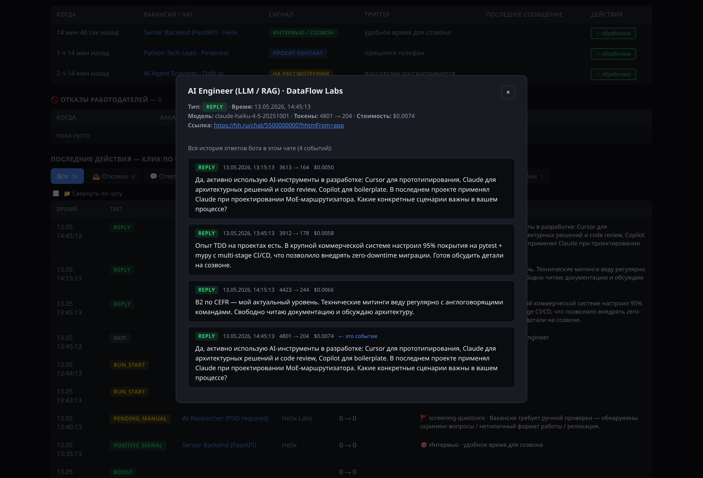
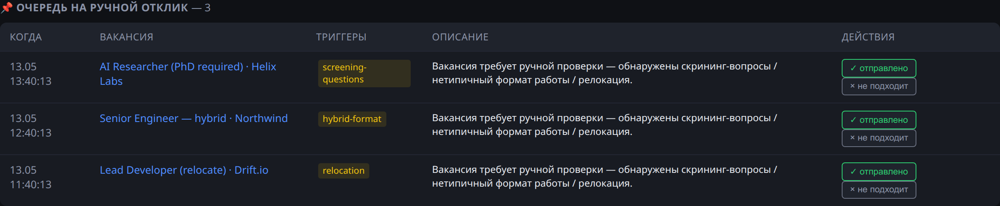

# hh-auto-apply

> Автоматизация поиска работы на HH.ru: умный поиск вакансий, AI-генерация сопроводительных писем и человечные ответы в чате. Личные данные пользователя — вне публичного кода.

[](https://www.python.org/)
[](LICENSE)
[](https://www.anthropic.com/claude)
[](https://playwright.dev/)
[](https://fastapi.tiangolo.com/)
[](https://github.com/astral-sh/ruff)

[](https://github.com/semernyakov/hh-auto-apply/stargazers)
[](https://github.com/semernyakov/hh-auto-apply/network/members)
[](https://github.com/semernyakov/hh-auto-apply/commits/main)
[](https://github.com/semernyakov/hh-auto-apply/issues)
[](https://github.com/semernyakov/hh-auto-apply/pulls)
[](CONTRIBUTING.md)

> [!CAUTION]
> **Отказ от ответственности.** Проект распространяется «как есть» исключительно в **образовательных и личных некоммерческих целях**. Использование может нарушать [Условия использования HH.ru](https://hh.ru/article/agreement_paid_services) и привести к **блокировке аккаунта**, финансовым потерям и иным последствиям — все риски на пользователе. **Авторы не несут ответственности** ни за какие прямые или косвенные убытки, связанные с использованием Проекта.
>
> Полный текст: [**DISCLAIMER.md**](DISCLAIMER.md). Запуская проект, вы безоговорочно с ним соглашаетесь.

---

## Скриншоты

| Главная страница дашборда | Свёртка по чату |
|---|---|
|  |  |
| Статус воркеров, метрики стоимости, активность за разные окна, конфигурация в одном месте. | Чекбокс «📁 Свернуть по чату» — `reply`/`skip` группируются по `chat_url`, в одну строку с бейджами `[N] [Nr] [Ns]` и сводной стоимостью. |

| История ответов в чате | Очередь на ручной отклик |
|---|---|
|  |  |
| Клик по строке `reply` → модалка со **всей** цепочкой ответов бота в этом чате: время, токены, стоимость каждого вызова. Текущее событие подсвечено. | Вакансии с триггерами `screening-questions`, `hybrid-format`, `relocation` отправляются на ручной разбор: вы видите вакансию, триггеры, можете отправить отклик или дисмиссить. |

> Скриншоты сделаны на демо-данных (`profile.example.py`). На вашей реальной установке таблицы будут заполнены вашими вакансиями и компаниями.

## Что умеет

- 🔍 **Поиск** вакансий по списку запросов + персональные рекомендации HH «по резюме».
- ✍️ **Сопроводительные письма** генерируются Claude Haiku 4.5 индивидуально под каждую вакансию (≈ $0.001–0.003 за отклик).
- 💬 **Ответы в чате** работодателю с расширенным анти-AI-детекторным промптом: разная длина предложений, отсутствие штампов, единичность проектов на ответ, бинарный режим для коротких вопросов, контекст всей цепочки.
- 🤖 **Детектор анкет-автоботов** (`Робот-рекрутёр` / `HR-бот` / серии однотипных вопросов): такие диалоги уходят в **отдельную очередь** — пользователь либо отвечает сам, либо отправляет ответ через бота прямо из дашборда (textarea → playwright → HH-чат).
- 🎯 **Положительные сигналы** (приглашение на интервью, запрос контакта, отклик на рассмотрении) — отдельная очередь + опционально Telegram-нотификации, чтобы не пропустить срочное.
- 🛡️ **Cooldown в чате**: если последний входящий блок не изменился с момента предыдущей обработки — Claude повторно не дёргается (`HH_REPLY_COOLDOWN_SEC`).
- 🚫 **Дедупликация**: не откликается дважды на одну вакансию (по `vacancy_id` или employer+title).
- 🚩 **Ручная очередь** на дашборде для пограничных случаев: скрининг-вопросы, гибридный формат, неоднозначные роли — пользователь решает сам.
- ⬆️ **Подъём резюме** в поиске на cooldown-таймере.
- 📊 **Веб-дашборд**: метрики, история чатов с полной цепочкой ответов, ручная очередь, положительные сигналы, анкеты автоботов, отказы, конверсия `reply → positive_signal`, пагинация.
- 🌚 **Headless-режим**: можно работать в фоне, окно браузера не мелькает.
- 🔐 **Privacy by design**: ФИО, проекты, ЗП — в `profile.py` (в `.gitignore`), публичный код полностью обезличен.
- ✅ **Покрыт тестами**: `python -m unittest tests.test_detectors` (26 проверок на детекторы ролей/анкет/сигналов, без внешних зависимостей).

---

## Quick start

```bash
git clone https://github.com/semernyakov/hh-auto-apply.git
cd hh-auto-apply

# 1. Виртуальное окружение + зависимости
python3 -m venv .venv
source .venv/bin/activate
pip install playwright python-dotenv anthropic fastapi uvicorn
playwright install chromium

# 2. Свой профиль (личные данные — НЕ попадают в git)
cp profile.example.py profile.py
$EDITOR profile.py

# 3. Anthropic API key — получить на https://console.anthropic.com/settings/keys
export ANTHROPIC_API_KEY=sk-ant-...

# 4. Авторизация на HH.ru: откроется браузер, залогиньтесь, сессия сохранится
python hh_login.py

# 5. Запуск дашборда (под капотом — uvicorn в фоне, HH_HEADLESS=1)
make start
# → откройте http://127.0.0.1:8765 и стартуйте воркеров кнопками
```

Подробный гайд: [SETUP_GUIDE.md](SETUP_GUIDE.md).

---

## Конфигурация

### `profile.py` (личное, в `.gitignore`)

| Поле | Назначение |
|---|---|
| `SEARCH_QUERIES` | Список поисковых запросов на HH (`"AI Engineer"`, `"Python Tech Lead"` …) |
| `MY_PROFILE` | Текстовое описание опыта, проектов, стека — передаётся Claude как контекст |
| `SELF_NAME_MARKERS` | Варианты написания ФИО (в нижнем регистре) — для определения авторства в чатах |
| `OWN_TEXT_MARKERS` | _(опционально)_ Список характерных фраз твоих **ручных** сообщений в HH-чате (отказы, прощания и т.п.) — content-override на случай, если HH не помечает пузырь CSS-классом owner/outgoing. Подробнее — см. `profile.example.py`. |
| `SALARY_ADDENDUM` | Добавляется к письму, если вакансия требует указать ЗП |
| `LETTER_SIGNATURE` | Подпись в письмах |

### Environment

| Переменная | По умолчанию | Что делает |
|---|---|---|
| `ANTHROPIC_API_KEY` | **обязательно** | Ключ для Claude API |
| `HH_HEADLESS` | `1` (через Makefile) | `1` — без окна, иначе — видимый Chromium |
| `HH_PROXY` | — | Прокси (например `socks5://127.0.0.1:2080`) |
| `HH_APPLY_INTERVAL_SEC` | `10800` (3 ч) | Интервал между проходами apply |
| `HH_WATCH_INTERVAL_SEC` | `1800` (30 мин) | Интервал проверки новых сообщений в чате |
| `HH_BOOST_INTERVAL_SEC` | `14700` | Интервал подъёма резюме |
| `HH_ALL_CHATS` | — | `1` — обходить ВСЕ чаты, не только непрочитанные (для отладки) |
| `HH_REPLY_COOLDOWN_SEC` | `600` (10 мин) | Защита от повтора: если последний входящий блок в чате не изменился, Claude повторно не дёргается. `0` — отключить. |
| `HH_DEV_RELOAD` | — | `1` — запускает дашборд с `uvicorn --reload`, удобно при правке HTML/JS внутри `dashboard.py`. В проде не использовать. |
| `TELEGRAM_BOT_TOKEN` | — | _(опционально)_ Токен Telegram-бота (получить у [@BotFather](https://t.me/BotFather)) для уведомлений о приглашениях и анкетах. Без него нотификации silently выключены. |
| `TELEGRAM_CHAT_ID` | — | _(опционально)_ ID получателя ([@userinfobot](https://t.me/userinfobot)). |
| `TELEGRAM_TIMEOUT_SEC` | `5` | Таймаут запросов к Telegram API. |

---

## Архитектура

```
┌──────────────┐  HTTP  ┌──────────────────────────────┐
│  Dashboard   │ ────→ │ /api/{status,events,…}        │
│  (HTML+JS)   │ ←──── │ FastAPI                       │
└──────────────┘        └──────┬────────────────────────┘
                               │ subprocess.Popen
        ┌──────────────────────┼──────────────────────┐
        ↓                      ↓                      ↓
  ┌────────────┐        ┌────────────┐        ┌────────────┐
  │  apply     │        │  reply     │        │  boost     │
  │ поиск +    │        │ чаты HH    │        │ подъём     │
  │ отклик     │        │ + Claude   │        │ резюме     │
  └─────┬──────┘        └─────┬──────┘        └─────┬──────┘
        └──────────────┬──────┴──────────────┬──────┘
                       ↓ Playwright          ↓ HTTPS
                  ┌────────────┐       ┌────────────────┐
                  │  HH.ru     │       │ Anthropic API  │
                  │ (Chromium) │       │ (Haiku 4.5)    │
                  └────────────┘       └────────────────┘

         metrics → SQLite (~/.n8n-files/hh_metrics.sqlite)
```

Три независимых воркера и дашборд. Все используют общую SQLite-БД для метрик и истории чатов; пересечений по записи в HH-сессию нет (одна сессия читается всеми, изменяется через `hh_login.py`).

---

## Очередь анкет от автоботов

HH-рекрутёры всё чаще присылают **скрининг-анкеты** автоматическим ботом (`Робот-рекрутёр`, `HR-бот` и т.п.) — пять-семь однотипных коротких вопросов подряд. Любой авто-ответ Claude на такую анкету уходит работодателю в summary и **отозвать его нельзя**.

Поэтому такие диалоги детектятся двумя стратегиями:
- **author-marker** — роль пузыря содержит `робот / hr-бот / bot / автоответ / чат-бот` и т.п.,
- **pattern series** — последние ≥2 входящих сообщения подряд начинаются с шаблонных зачинов («был ли у вас опыт», «есть ли», «сколько лет опыта», «какой у вас стек», …).

Сработавший детектор:
1. **Не дёргает Claude** — диалог уходит в отдельный раздел дашборда «🤖 Анкеты автоботов».
2. **Опционально шлёт Telegram-уведомление** со списком всех вопросов из истории.
3. Пользователь решает, что делать — у каждой записи 3 кнопки:
   - 📤 **Отправить через бота** — открывает textarea, пишете ответ, бот заходит в чат под вашей сессией и постит.
   - ✓ **Уже ответил вручную** — пометить как обработанное.
   - ✗ **Отказаться** — игнорировать анкету, убрать из очереди.

## Telegram-уведомления

Опциональный модуль `notify.py`. Шлёт сообщение в Telegram при появлении положительного сигнала (приглашение, контакт, на рассмотрении) и при первой анкете от автобота в новом чате. Если `TELEGRAM_BOT_TOKEN` или `TELEGRAM_CHAT_ID` не заданы — модуль превращается в no-op, на основной воркер это не влияет.

Быстрая проверка связи:
```bash
TELEGRAM_BOT_TOKEN=... TELEGRAM_CHAT_ID=... python3 notify.py
```

## Тесты

```bash
python3 -m unittest tests.test_detectors -v
```

26 unit-тестов на детекторы ролей в чате (`_detect_role`, `_text_is_own`), анкет автоботов (`is_robot_questionnaire`), отказов (`is_rejection`), положительных сигналов (`detect_positive_signal`). Зависимости (anthropic/playwright/dotenv) замокированы в `tests/conftest.py`, тесты запускаются на чистом Python без `pip install`. Совместимы и с `pytest`, если он установлен.

## Миграция ролей в истории чатов

Если вы недавно обновились с версии до фикса `db56e48` (распознавание роли по CSS-классу пузыря), некоторые ваши прошлые ручные сообщения в `payload.history_tail` могли быть атрибутированы работодателю. Безопасный скрипт пересобирает разметку:

```bash
python3 migrate_history_roles.py --days 60            # dry-run, печатает превью
python3 migrate_history_roles.py --days 60 --apply    # запись (предварительно — бэкап SQLite!)
```

Перед `--apply` сделайте копию `~/.n8n-files/hh_metrics.sqlite`. Скрипт переписывает только префиксы блоков, исходный текст сообщений не трогает.

---

## Что точно НЕ делает этот проект

- Не обходит капчу.
- Не парсит закрытые/премиум вакансии.
- Не имитирует human-fingerprint на низком уровне (canvas, WebGL и т.п.) — только разумные паузы и headless с реалистичным viewport.
- Не работает как «массовая рассылка»: дефолтные интервалы — 3 ч между проходами, 7 сек между откликами. Эти лимиты намеренно консервативны.
- Не собирает данные о других людях/работодателях за пределами того, что HH сам показывает залогиненному пользователю.

---

## Приватность данных пользователя

Публичный код **не содержит**:
- ФИО владельца резюме
- Названий реальных проектов из биографии
- Бывших работодателей
- Зарплатных ожиданий
- Email, телефонов, мессенджеров
- API-ключей, resume_id, vacancy_id

Всё это берётся из локального `profile.py` (в `.gitignore`). Скрипт-аудит на CI (например `git grep -E "ваше_фио|реальный_email"`) можно добавить как pre-commit-hook.

---

## Лицензия

[MIT](LICENSE) — свободно используйте, форкайте, модифицируйте. Атрибуция приветствуется, но не обязательна. Никаких гарантий, ответственность — на пользователе.

---

## Contributing

PR-ы приветствуются — см. [CONTRIBUTING.md](CONTRIBUTING.md) для воркфлоу, стиля кода, чек-листа перед PR.

## Security

Если нашли утечку приватных данных, XSS, SQL-injection или иную уязвимость — **не открывайте публичный issue**. Воспользуйтесь GitHub Security Advisories, подробности и шаблон отчёта — в [SECURITY.md](SECURITY.md).
